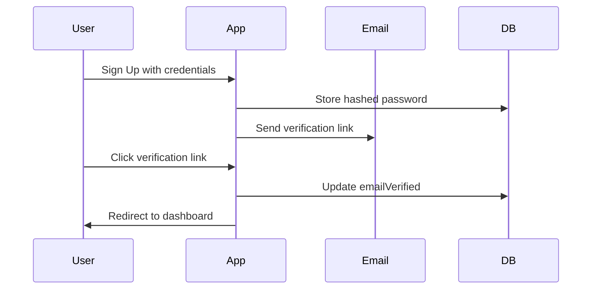

<!-- Project Header -->
<p align="center">
  <h1 align="center">Quantiri – Subscription SaaS Dashboard with AI Data Assistant</h1>
  <p align="center">
    A <strong>production-grade SaaS platform</strong> built with <strong>Next.js 15</strong>, showcasing <strong>senior-level engineering standards</strong> and <strong>modern full-stack practices</strong>.
    <br />
    <em>Secure authentication • AI-ready • Real-time dashboards • Polished UI</em>
  </p>
</p>
<p align="center">
  
  
  
  
  
  
</p>

---

## 🚀 Overview

**Quantiri** is a **production-grade SaaS dashboard** built with **Next.js 15**, designed to **demonstrate senior engineering excellence**.  
The MVP includes **secure authentication with email verification**, laying the foundation for:

- Subscription management
- Real-time collaborative dashboards
- An AI-powered data assistant

---

## ✨ Current Features

- **🔒 Secure Auth** — Credentials-based authentication via NextAuth.js (JWT)
- **✅ Email Verification** — Short-lived, hashed tokens via Resend
- **🛡️ Security-First** — Zod validation, bcrypt hashing, Prisma ORM
- **🎨 Polished UI** — TailwindCSS + shadcn/ui + Framer Motion animations
- **📡 Database** — Neon PostgreSQL + Prisma
- **📦 Senior Repo Hygiene** — ESLint flat config, Prettier, Husky, lint-staged, commitlint

---

## 📂 Tech Stack

| Category         | Technology               |
| ---------------- | ------------------------ |
| Framework        | Next.js 15 (App Router)  |
| Language         | TypeScript               |
| Styling          | TailwindCSS + shadcn/ui  |
| State Management | Zustand                  |
| Data Fetching    | TanStack Query           |
| Auth             | NextAuth.js (JWT)        |
| DB               | Neon PostgreSQL + Prisma |
| Email            | Resend                   |
| AI (planned)     | Groq API                 |

---

## 🗂 Project Architecture

```mermaid
flowchart TD
    subgraph Client
        UI[Next.js 15 + Tailwind + shadcn/ui]
        State[Zustand + TanStack Query]
    end

    subgraph Server
        API[Next.js API Routes]
        Auth[NextAuth.js + JWT]
        DBService[Prisma ORM]
    end

    subgraph External
        DB[(Neon PostgreSQL)]
        Email[Resend API]
        AI[Groq API (planned)]
    end

    UI --> API
    State --> API
    API --> Auth
    API --> DBService
    DBService --> DB
    API --> Email
    API --> AI
```

## 🔑 Authentication Flow



---

## ⚙️ Environment Variables

Create a `.env` file in the root of your project:

```env
NEXTAUTH_SECRET=<secure_random_string>
NEXTAUTH_URL=https://your-vercel-domain.vercel.app
DATABASE_URL=postgresql://<user>:<pass>@<host>/<db>
RESEND_API_KEY=<your_resend_api_key>
```

---

## 🛠️ Getting Started

### 1️⃣ Clone the repository

```bash
git clone https://github.com/<your-username>/quantiri.git
cd quantiri
```

### 2️⃣ Install dependencies

```bash
pnpm install
```

### 3️⃣ Setup environment variables

Create a `.env` file with the values listed above.

### 4️⃣ Database setup

```bash
pnpm prisma migrate dev
pnpm prisma generate
```

### 5️⃣ Run the development server

```bash
pnpm dev
```

Visit http://localhost:3000 🎉

---

## 📌 Vision

Planned next steps:

- Password reset flow
- OAuth providers (Google, GitHub)
- Role-based permissions (ADMIN, USER)
- AI data chat assistant
- Real-time dashboard widgets

---

## 🤝 Contributing

Contributions are welcome!
Please open an issue or pull request if you have suggestions or improvements.

---

## 📜 License

MIT License © 2025 Nibras Ali
